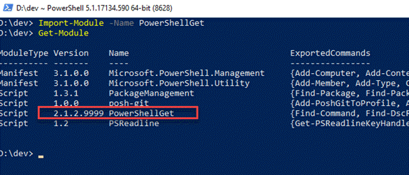

[](https://gitter.im/PowerShell/PowerShellGet?utm_source=badge&utm_medium=badge&utm_campaign=pr-badge&utm_content=badge)
[](https://github.com/PowerShell/PowerShellGet/blob/development/LICENSE)
[](https://msdn.microsoft.com/en-us/powershell/gallery/psget)
[](https://www.powershellgallery.com/packages/PowerShellGet)
[](https://github.com/PowerShell/PowerShellGet)

Important Note
==============

This version of the module is currently not in development.
We are no longer accepting any pull requests to this repository and are not planning any future releases.
If you have a question, or are seeing an unexpected behavior from PowerShellGet 2.x or below please open an issue in this repository.
We are tracking the on-going development of the new version of this module in the  [PowerShell/PowerShellGet](https://github.com/powershell/powershellget) repository.
The [PowerShell/PowerShellGet](https://github.com/powershell/powershellget) repository is also the best place to open any feature requests for this module.

Introduction
============

PowerShellGet is a PowerShell module with commands for discovering, installing, updating and publishing the PowerShell artifacts like Modules, DSC Resources, Role Capabilities and Scripts.

PowerShellGet module is also integrated with the PackageManagement module as a provider, users can also use the PackageManagement cmdlets for discovering, installing and updating the PowerShell artifacts like Modules and Scripts.


Build status
============

## Development branch

|         OS - PS Version             |          Build Status        |
|-------------------------------------|------------------------------|
| AppVeyor (Windows - PS 4.0)         | [![d-av-image][]][d-av-site] |
| AppVeyor (Windows - PS 5.1)         | [![d-av-image][]][d-av-site] |
| AppVeyor (Windows - PS 6.0.0+)      | [![d-av-image][]][d-av-site] |
| Travis CI (Linux - PS 6.0.0+)       | [![d-tv-image][]][d-tv-site] |
| Travis CI (MacOS - PS 6.0.0+)       | [![d-tv-image][]][d-tv-site] |

## Master branch
|         OS - PS Version             |          Build Status        |
|-------------------------------------|------------------------------|
| AppVeyor (Windows - PS 4.0)         | [![m-av-image][]][m-av-site] |
| AppVeyor (Windows - PS 5.1)         | [![m-av-image][]][m-av-site] |
| AppVeyor (Windows - PS 6.0.0+)      | [![m-av-image][]][m-av-site] |
| Travis CI (Linux - PS 6.0.0+)       | [![m-tv-image][]][m-tv-site] |
| Travis CI (MacOS - PS 6.0.0+)       | [![m-tv-image][]][m-tv-site] |

[d-av-image]: https://ci.appveyor.com/api/projects/status/91p7lpjoxit3gw72/branch/development?svg=true
[d-av-site]: https://ci.appveyor.com/project/PowerShell/powershellget/branch/development
[d-tv-image]: https://travis-ci.org/PowerShell/PowerShellGet.svg?branch=development
[d-tv-site]: https://travis-ci.org/PowerShell/PowerShellGet/branches

[m-av-image]: https://ci.appveyor.com/api/projects/status/91p7lpjoxit3gw72/branch/master?svg=true
[m-av-site]: https://ci.appveyor.com/project/PowerShell/powershellget/branch/master
[m-tv-image]: https://travis-ci.org/PowerShell/PowerShellGet.svg?branch=master
[m-tv-site]: https://travis-ci.org/PowerShell/PowerShellGet/branches


Daily Build status
====================

## Development branch

|         OS - PS Version             |          Build Status        |
|-------------------------------------|------------------------------|
| AppVeyor (Windows - PS 4.0)         | [![d-n-av-image][]][d-n-av-site] |
| AppVeyor (Windows - PS 5.1)         | [![d-n-av-image][]][d-n-av-site] |
| AppVeyor (Windows - PS 6.0.0+)      | [![d-n-av-image][]][d-n-av-site] |
| Travis CI (Linux - PS 6.0.0+)       | [![d-tv-image][]][d-tv-site] |
| Travis CI (MacOS - PS 6.0.0+)       | [![d-tv-image][]][d-tv-site] |

[d-n-av-image]: https://ci.appveyor.com/api/projects/status/58muo6i0x8n38pd3/branch/development?svg=true
[d-n-av-site]: https://ci.appveyor.com/project/PowerShell/powershellget-0lib3/branch/development

Documentation
=============

[Click here](https://docs.microsoft.com/powershell/scripting/gallery/installing-psget?view=powershell-6)


Requirements
============

- Windows PowerShell 3.0 or newer.
- PowerShell Core.

Module Dependencies
===================

- PackageManagement module

Get PowerShellGet Module
========================

Please refer to our [documentation](https://aka.ms/installing-psget) for the up-to-date version on how to get the PowerShellGet Module.


Get PowerShellGet Source
========================

#### Steps
* Obtain the source
    - Download the latest source code from the release page (https://github.com/PowerShell/PowerShellGet/releases) OR
    - Clone the repository (needs git)
    ```powershell
    git clone https://github.com/PowerShell/PowerShellGet
    ```
* Navigate to the source directory
```powershell
cd path/to/PowerShellGet
```

* Import the module
```powershell
Import-Module src/PowerShellGet
```


Local Development
=================
### Visual Studio Code:-
1. Open VSCode choosing "Run as Administrator"
2. Select Terminal>Run Task>Install Dependencies
3. Select Terminal>Run Task>Build and Import Module

for subsequent changes you can just run 'Build and Import Module' or press <kbd>ctrl</kbd> + <kbd>shift</kbd> + <kbd>B</kbd>

### Standard PowerShell:-
1. Open an administrative PowerShell prompt
2. Run the following commands
```PowerShell
Import-Module "$ClonePath\tools\build.psm1"
Install-Dependencies
Install-DevelopmentModule
```

This will take the published module from ./dist and install it into the powershell module path under the current version of PowerShellGet apending 9999 to the version number.

An explicit or implicit (such as when the test suite is invoked) import of the PowerShell get module will ensure the module version under development gets loaded.

It is therefore easy to see with  ```Get Module``` that the version under development is loaded, like this:-



To remove this module and revert to the production PowerShellGallery published version, simply remove the folder from the module path. (if running VSCode select Terminal>Run Task>Remove Development Module).

Running Tests
=============

### VSCode
You can run the test task Terminal>Run Task>Run Full Test Suite

### Non VSCode

Pester-based PowerShellGet Tests are located in `<branch>/PowerShellGet/Tests` folder.

Run following commands in PowerShell Console with Administrator privileges.

```powershell
Import-Module "$ClonePath\tools\build.psm1"
Install-Dependencies
Invoke-PowerShellGetTest
```

Contributing to PowerShellGet
==============================
You are welcome to contribute to this project. There are many ways to contribute:

- Submit a bug report via [Issues]( https://github.com/PowerShell/PowerShellGet/issues). For a guide to submitting good bug reports, please read [Painless Bug Tracking](http://www.joelonsoftware.com/articles/fog0000000029.html).
- Read the documentation on [contributing to open source](https://guides.github.com/activities/contributing-to-open-source/) and [forking](https://guides.github.com/activities/forking/).
- Verify fixes for bugs.
- Submit your fixes for a bug. Before submitting, please make sure you have:
  * Performed code reviews of your own
  * Updated the test cases if needed
  * Run the test cases to ensure no feature breaks or test breaks
  * Added the test cases for new code
- Submit a feature request.
- Help answer questions in the discussions list.
- Submit test cases.
- Tell others about the project.
- Tell the developers how much you appreciate the product!

You might also read these two blog posts about contributing code: [Open Source Contribution Etiquette](http://tirania.org/blog/archive/2010/Dec-31.html) by Miguel de Icaza, and [Don’t “Push” Your Pull Requests](http://www.igvita.com/2011/12/19/dont-push-your-pull-requests/) by Ilya Grigorik.

Before submitting a feature or substantial code contribution, please discuss it with the Windows PowerShell team via [Issues](https://github.com/PowerShell/PowerShellGet/issues), and ensure it follows the product roadmap. Note that all code submissions will be rigorously reviewed by the Windows PowerShell Team. Only those that meet a high bar for both quality and roadmap fit will be merged into the source.

# [Code of Conduct](CODE_OF_CONDUCT.md)
This project has adopted the [Microsoft Open Source Code of Conduct](https://opensource.microsoft.com/codeofconduct/). For more information see the [Code of Conduct FAQ](https://opensource.microsoft.com/codeofconduct/faq/) or contact [opencode@microsoft.com](mailto:opencode@microsoft.com) with any additional questions or comments.
